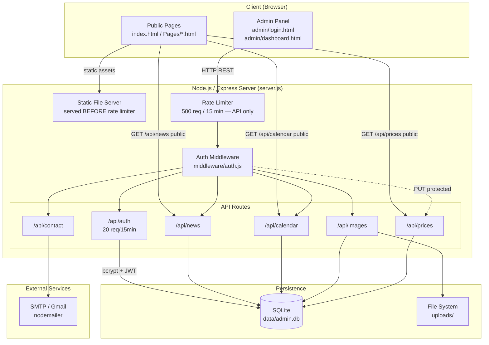
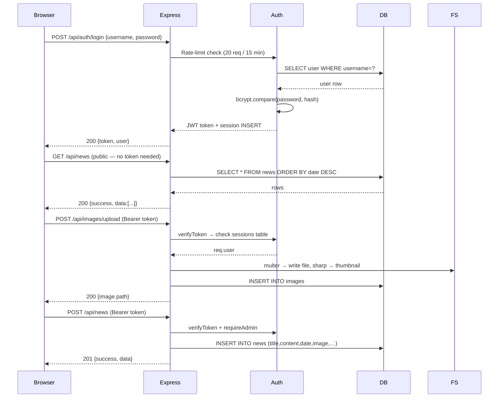
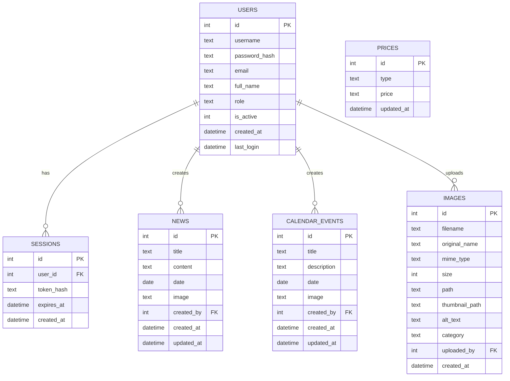
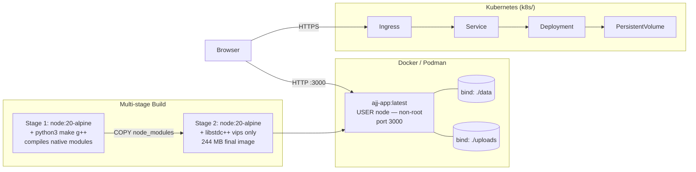

# 🏗️ Architecture — Asnières Jujitsu Website

## System Architecture



---

## Application Flow



---

## Database Schema



> **Note :** Le champ `image` de `calendar_events` a été ajouté en v3.0 via `ALTER TABLE`.  
> Si votre base a été initialisée avant v3.0 et que vous ne voyez pas ce champ, exécutez :  
> ```bash
> node -e "const db=require('better-sqlite3')('./data/admin.db'); db.prepare('ALTER TABLE calendar_events ADD COLUMN image TEXT DEFAULT NULL').run(); db.close();"
> ```

---

## Deployment Topology



---

*Made with ❤️ by Bob — last updated Juillet 2026 (v3.0)*
