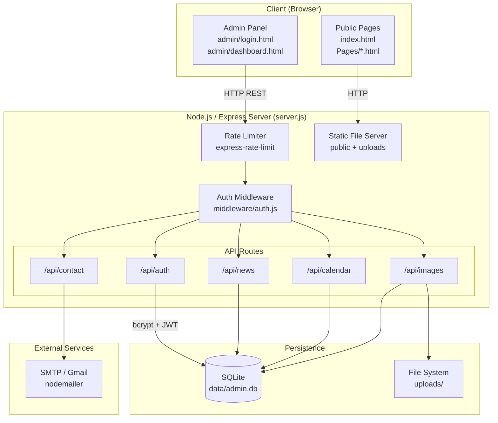
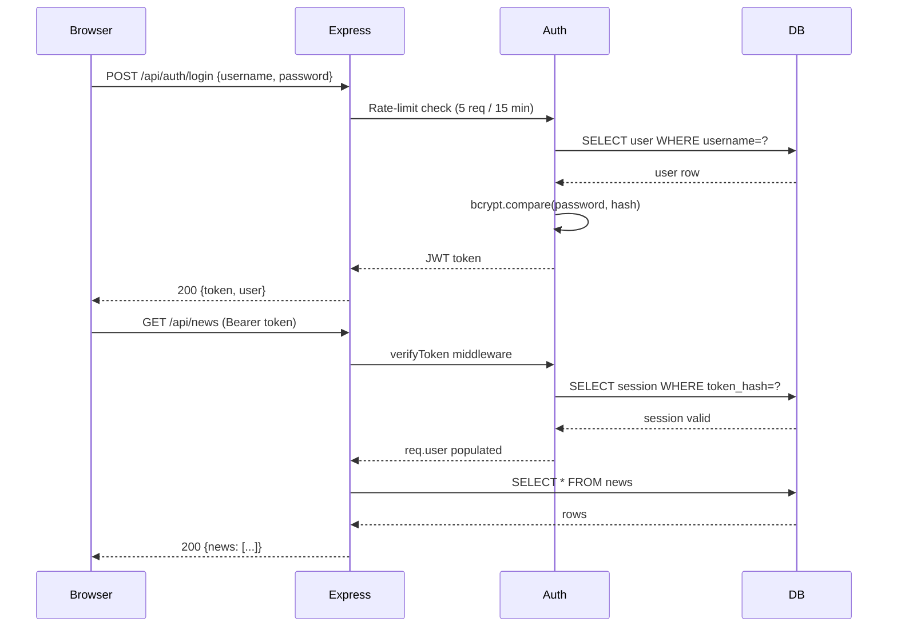
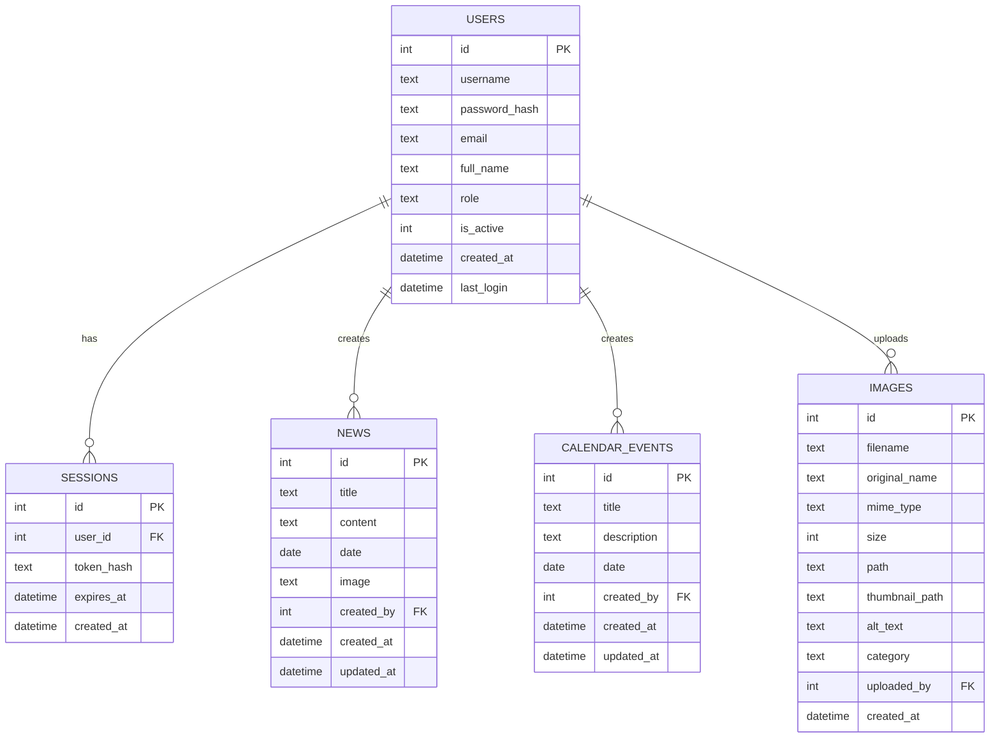
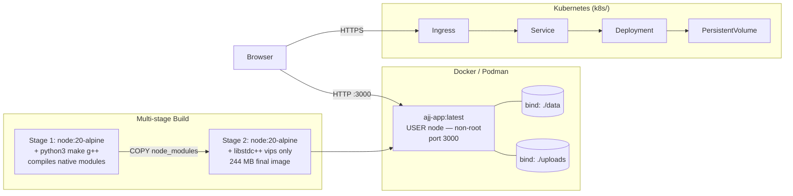

# 🏗️ Architecture — Asnières Jujitsu Website

## System Architecture

```mermaid
graph TB
    subgraph Client["Client (Browser)"]
        PUB[Public Pages<br/>index.html<br/>Pages/*.html]
        ADM[Admin Panel<br/>admin/login.html<br/>admin/dashboard.html]
    end

    subgraph Server["Node.js / Express Server (server.js)"]
        RL[Rate Limiter<br/>express-rate-limit]
        AUTH_MW[Auth Middleware<br/>middleware/auth.js]
        STATIC[Static File Server<br/>public + uploads]

        subgraph Routes["API Routes"]
            R_AUTH["/api/auth"]
            R_NEWS["/api/news"]
            R_CAL["/api/calendar"]
            R_CONTACT["/api/contact"]
            R_IMG["/api/images"]
        end
    end

    subgraph Storage["Persistence"]
        DB[(SQLite<br/>data/admin.db)]
        FS[File System<br/>uploads/]
    end

    subgraph External["External Services"]
        SMTP[SMTP / Gmail<br/>nodemailer]
    end

    PUB -->|HTTP| STATIC
    ADM -->|HTTP REST| RL
    RL --> AUTH_MW
    AUTH_MW --> R_AUTH
    AUTH_MW --> R_NEWS
    AUTH_MW --> R_CAL
    AUTH_MW --> R_CONTACT
    AUTH_MW --> R_IMG

    R_AUTH -->|bcrypt + JWT| DB
    R_NEWS --> DB
    R_CAL --> DB
    R_IMG --> DB
    R_IMG --> FS
    R_CONTACT --> SMTP
```

---

## Application Flow

```mermaid
sequenceDiagram
    participant Browser
    participant Express
    participant Auth
    participant DB

    Browser->>Express: POST /api/auth/login {username, password}
    Express->>Auth: Rate-limit check (5 req / 15 min)
    Auth->>DB: SELECT user WHERE username=?
    DB-->>Auth: user row
    Auth->>Auth: bcrypt.compare(password, hash)
    Auth-->>Express: JWT token
    Express-->>Browser: 200 {token, user}

    Browser->>Express: GET /api/news (Bearer token)
    Express->>Auth: verifyToken middleware
    Auth->>DB: SELECT session WHERE token_hash=?
    DB-->>Auth: session valid
    Auth-->>Express: req.user populated
    Express->>DB: SELECT * FROM news
    DB-->>Express: rows
    Express-->>Browser: 200 {news: [...]}
```

---

## Database Schema

```mermaid
erDiagram
    USERS {
        int id PK
        text username
        text password_hash
        text email
        text full_name
        text role
        int is_active
        datetime created_at
        datetime last_login
    }
    SESSIONS {
        int id PK
        int user_id FK
        text token_hash
        datetime expires_at
        datetime created_at
    }
    NEWS {
        int id PK
        text title
        text content
        date date
        text image
        int created_by FK
        datetime created_at
        datetime updated_at
    }
    CALENDAR_EVENTS {
        int id PK
        text title
        text description
        date date
        int created_by FK
        datetime created_at
        datetime updated_at
    }
    IMAGES {
        int id PK
        text filename
        text original_name
        text mime_type
        int size
        text path
        text thumbnail_path
        text alt_text
        text category
        int uploaded_by FK
        datetime created_at
    }

    USERS ||--o{ SESSIONS : "has"
    USERS ||--o{ NEWS : "creates"
    USERS ||--o{ CALENDAR_EVENTS : "creates"
    USERS ||--o{ IMAGES : "uploads"
```

---

## Deployment Topology

```mermaid
graph LR
    subgraph Build["Multi-stage Build"]
        B1[Stage 1: node:20-alpine<br/>+ python3 make g++<br/>compiles native modules]
        B2[Stage 2: node:20-alpine<br/>+ libstdc++ vips only<br/>244 MB final image]
        B1 -->|COPY node_modules| B2
    end

    subgraph Container["Docker / Podman"]
        APP[ajj-app:latest<br/>USER node — non-root<br/>port 3000]
        VOL_DB[(bind: ./data)]
        VOL_UP[(bind: ./uploads)]
        APP --- VOL_DB
        APP --- VOL_UP
    end

    subgraph K8s["Kubernetes (k8s/)"]
        ING[Ingress]
        SVC[Service]
        DEP[Deployment]
        PV[PersistentVolume]
        ING --> SVC --> DEP --> PV
    end

    B2 --> APP
    Browser -->|HTTPS| ING
    Browser -->|HTTP :3000| APP
```
