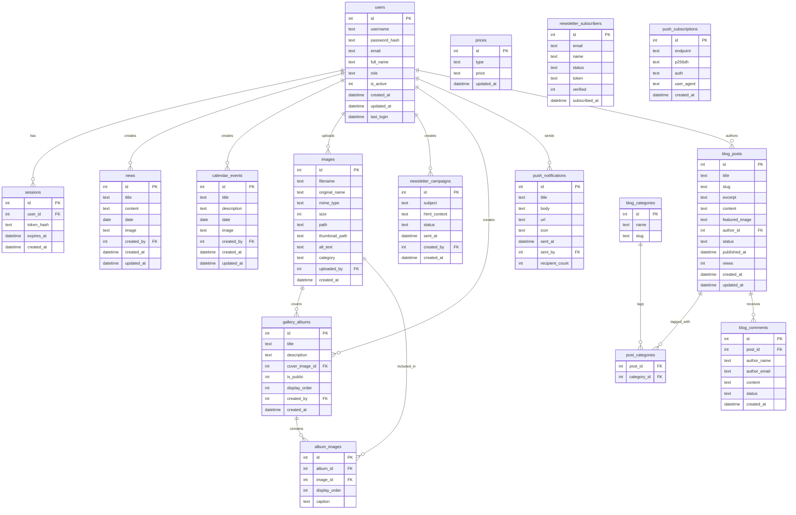
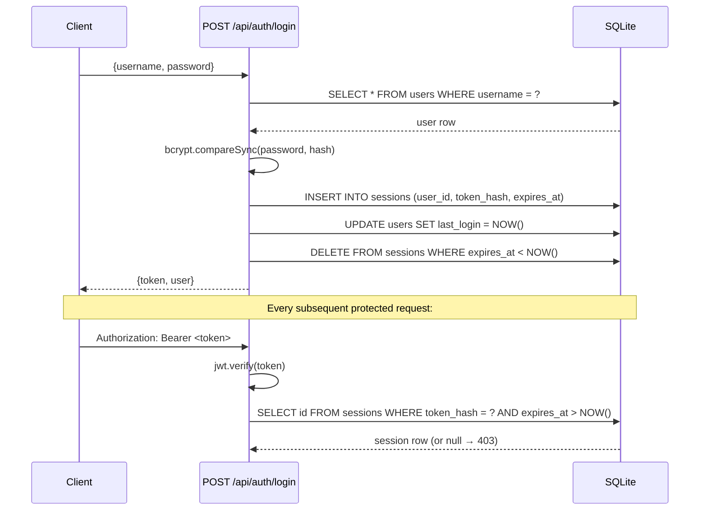
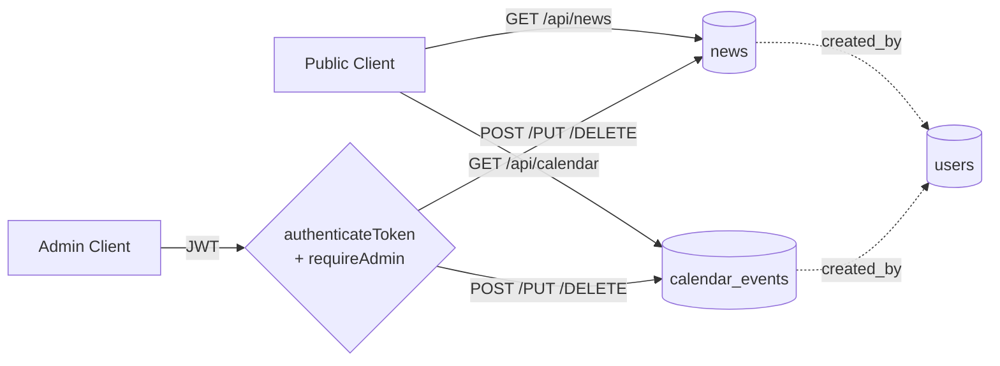
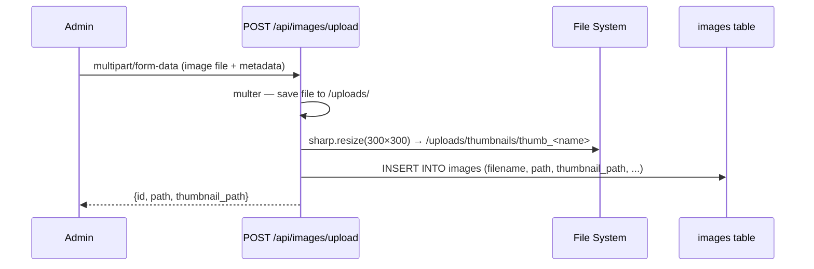
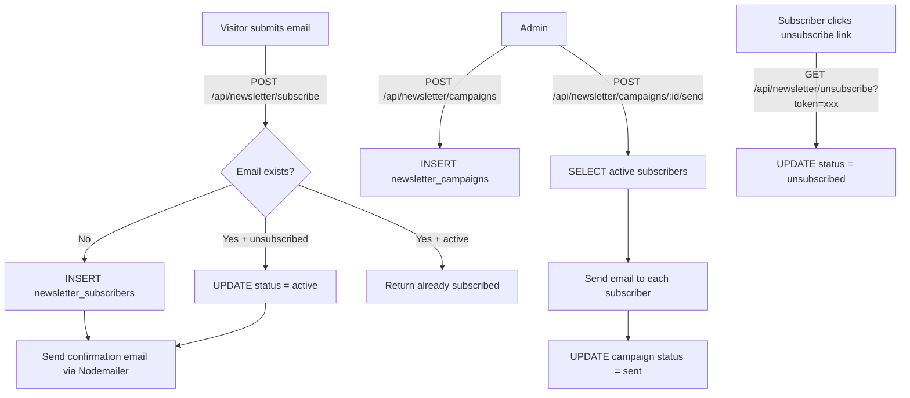
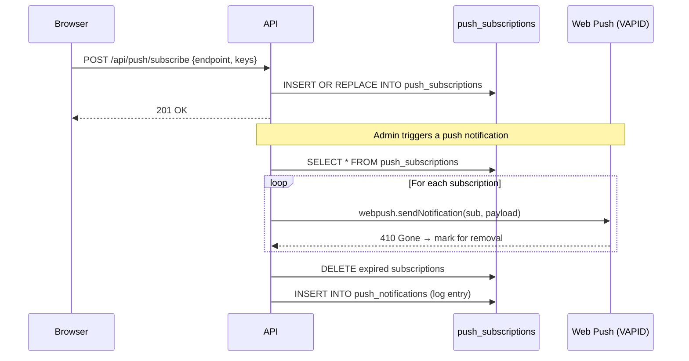
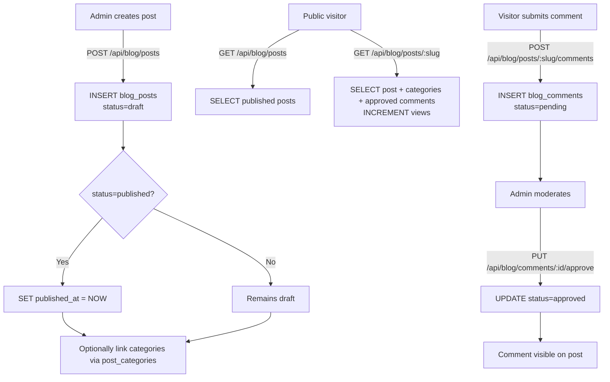

# Base de Données — Documentation Technique

> **Engine:** SQLite via `better-sqlite3`  
> **File:** `./data/admin.db` (configurable via `DB_PATH` env variable)  
> **Init script:** [`scripts/init-db.js`](../scripts/init-db.js)

---

## Table of Contents

1. [Schema Overview](#schema-overview)
2. [Tables](#tables)
   - [users](#1-users)
   - [sessions](#2-sessions)
   - [news](#3-news)
   - [calendar_events](#4-calendar_events)
   - [images](#5-images)
   - [prices](#6-prices)
   - [newsletter_subscribers](#7-newsletter_subscribers)
   - [newsletter_campaigns](#8-newsletter_campaigns)
   - [gallery_albums](#9-gallery_albums)
   - [album_images](#10-album_images)
   - [push_subscriptions](#11-push_subscriptions)
   - [push_notifications](#12-push_notifications)
   - [blog_posts](#13-blog_posts)
   - [blog_categories](#14-blog_categories)
   - [post_categories](#15-post_categories)
   - [blog_comments](#16-blog_comments)
3. [Relations Diagram](#relations-diagram)
4. [Indexes](#indexes)
5. [API Flows](#api-flows)
   - [Authentication Flow](#authentication-flow)
   - [Content Management Flow](#content-management-flow)
   - [Image Upload Flow](#image-upload-flow)
   - [Newsletter Flow](#newsletter-flow)
   - [Push Notification Flow](#push-notification-flow)
   - [Blog Flow](#blog-flow)
6. [Default Seed Data](#default-seed-data)

---

## Schema Overview

The database consists of **16 tables** organized into 7 functional domains:

| Domain | Tables |
|---|---|
| 🔐 Authentication | `users`, `sessions` |
| 📰 Content | `news`, `calendar_events` |
| 🖼️ Media | `images` |
| 💰 Configuration | `prices` |
| 📧 Newsletter | `newsletter_subscribers`, `newsletter_campaigns` |
| 🖼️ Gallery | `gallery_albums`, `album_images` |
| 🔔 Push Notifications | `push_subscriptions`, `push_notifications` |
| 📝 Blog | `blog_posts`, `blog_categories`, `post_categories`, `blog_comments` |

---

## Tables

### 1. `users`

Stores administrator accounts. All write operations on content tables are gated behind this table.

| Column | Type | Constraints | Description |
|---|---|---|---|
| `id` | INTEGER | PK, AUTOINCREMENT | Unique user identifier |
| `username` | TEXT | UNIQUE, NOT NULL | Login username |
| `password_hash` | TEXT | NOT NULL | bcrypt-hashed password |
| `email` | TEXT | — | Contact email |
| `full_name` | TEXT | — | Display name |
| `role` | TEXT | DEFAULT `'admin'` | User role (`admin`) |
| `is_active` | INTEGER | DEFAULT `1` | Account enabled flag (0 = disabled) |
| `created_at` | DATETIME | DEFAULT NOW | Record creation timestamp |
| `updated_at` | DATETIME | DEFAULT NOW | Last update timestamp |
| `last_login` | DATETIME | — | Last successful login timestamp |

---

### 2. `sessions`

Tracks active JWT tokens for session validation and revocation. Expired sessions are cleaned up on each login.

| Column | Type | Constraints | Description |
|---|---|---|---|
| `id` | INTEGER | PK, AUTOINCREMENT | Unique session identifier |
| `user_id` | INTEGER | NOT NULL, FK → `users.id` CASCADE | Owning user |
| `token_hash` | TEXT | NOT NULL | SHA-256 hash of the JWT token |
| `expires_at` | DATETIME | NOT NULL | Token expiration time (24 hours) |
| `created_at` | DATETIME | DEFAULT NOW | Session creation timestamp |

---

### 3. `news`

Stores news articles displayed on the public website.

| Column | Type | Constraints | Description |
|---|---|---|---|
| `id` | INTEGER | PK, AUTOINCREMENT | Unique news identifier |
| `title` | TEXT | NOT NULL | Article title |
| `content` | TEXT | NOT NULL | Article body (HTML or plain text) |
| `date` | DATE | NOT NULL | Publication / event date |
| `image` | TEXT | — | URL or path to an associated image |
| `created_by` | INTEGER | FK → `users.id` | Admin who created the entry |
| `created_at` | DATETIME | DEFAULT NOW | Record creation timestamp |
| `updated_at` | DATETIME | DEFAULT NOW | Last update timestamp |

---

### 4. `calendar_events`

Stores upcoming events shown in the public calendar.

| Column | Type | Constraints | Description |
|---|---|---|---|
| `id` | INTEGER | PK, AUTOINCREMENT | Unique event identifier |
| `title` | TEXT | NOT NULL | Event title |
| `description` | TEXT | NOT NULL | Event description |
| `date` | DATE | NOT NULL | Event date |
| `image` | TEXT | — | Optional event image URL/path |
| `created_by` | INTEGER | FK → `users.id` | Admin who created the entry |
| `created_at` | DATETIME | DEFAULT NOW | Record creation timestamp |
| `updated_at` | DATETIME | DEFAULT NOW | Last update timestamp |

---

### 5. `images`

Central media library. All uploaded images are registered here and referenced by other tables.

| Column | Type | Constraints | Description |
|---|---|---|---|
| `id` | INTEGER | PK, AUTOINCREMENT | Unique image identifier |
| `filename` | TEXT | NOT NULL | Stored filename (UUID-based) |
| `original_name` | TEXT | NOT NULL | Original upload filename |
| `mime_type` | TEXT | NOT NULL | MIME type (e.g. `image/jpeg`) |
| `size` | INTEGER | NOT NULL | File size in bytes |
| `path` | TEXT | NOT NULL | Public URL path (`/uploads/<filename>`) |
| `thumbnail_path` | TEXT | — | Public URL path to thumbnail (`/uploads/thumbnails/thumb_<filename>`) |
| `alt_text` | TEXT | — | Accessibility description |
| `category` | TEXT | DEFAULT `'general'` | Organisational category tag |
| `uploaded_by` | INTEGER | FK → `users.id` | Admin who uploaded the image |
| `created_at` | DATETIME | DEFAULT NOW | Upload timestamp |

---

### 6. `prices`

Stores the membership price list. Seeded with default values and updated by admins.

| Column | Type | Constraints | Description |
|---|---|---|---|
| `id` | INTEGER | PK, AUTOINCREMENT | Unique price identifier |
| `type` | TEXT | UNIQUE, NOT NULL | Price category label (e.g. `Adulte`, `Mineur`) |
| `price` | TEXT | NOT NULL | Price value as string (e.g. `320€`) |
| `updated_at` | DATETIME | DEFAULT NOW | Last update timestamp |

**Default seed values:**

| type | price |
|---|---|
| Adulte | 320€ |
| Mineur | 270€ |
| Ceinture Noire | 210€ |
| Remise en forme | 190€ |

---

### 7. `newsletter_subscribers`

Stores newsletter subscription records. Supports active / unsubscribed statuses and token-based unsubscribe links.

| Column | Type | Constraints | Description |
|---|---|---|---|
| `id` | INTEGER | PK, AUTOINCREMENT | Unique subscriber identifier |
| `email` | TEXT | UNIQUE, NOT NULL | Subscriber email address |
| `name` | TEXT | — | Subscriber display name |
| `status` | TEXT | DEFAULT `'active'` | Subscription status: `active` or `unsubscribed` |
| `token` | TEXT | UNIQUE, NOT NULL | UUID token used for unsubscribe links |
| `verified` | INTEGER | DEFAULT `0` | Email verification flag |
| `subscribed_at` | DATETIME | DEFAULT NOW | Subscription timestamp |

---

### 8. `newsletter_campaigns`

Stores newsletter campaign drafts and their send history.

| Column | Type | Constraints | Description |
|---|---|---|---|
| `id` | INTEGER | PK, AUTOINCREMENT | Unique campaign identifier |
| `subject` | TEXT | NOT NULL | Email subject line |
| `html_content` | TEXT | NOT NULL | Full HTML body of the email |
| `status` | TEXT | DEFAULT `'draft'` | Campaign status: `draft` or `sent` |
| `sent_at` | DATETIME | — | Timestamp when campaign was sent |
| `created_by` | INTEGER | FK → `users.id` | Admin who created the campaign |
| `created_at` | DATETIME | DEFAULT NOW | Record creation timestamp |

---

### 9. `gallery_albums`

Organises images into named albums for the public gallery.

| Column | Type | Constraints | Description |
|---|---|---|---|
| `id` | INTEGER | PK, AUTOINCREMENT | Unique album identifier |
| `title` | TEXT | NOT NULL | Album title |
| `description` | TEXT | — | Album description |
| `cover_image_id` | INTEGER | FK → `images.id` SET NULL | Cover image reference |
| `is_public` | INTEGER | DEFAULT `1` | Visibility flag (0 = private, 1 = public) |
| `display_order` | INTEGER | DEFAULT `0` | Sort order for the gallery listing |
| `created_by` | INTEGER | FK → `users.id` | Admin who created the album |
| `created_at` | DATETIME | DEFAULT NOW | Record creation timestamp |

---

### 10. `album_images`

Join table linking albums to images with ordering and caption support. Each `(album_id, image_id)` pair is unique.

| Column | Type | Constraints | Description |
|---|---|---|---|
| `id` | INTEGER | PK, AUTOINCREMENT | Unique row identifier |
| `album_id` | INTEGER | NOT NULL, FK → `gallery_albums.id` CASCADE | Parent album |
| `image_id` | INTEGER | NOT NULL, FK → `images.id` CASCADE | Linked image |
| `display_order` | INTEGER | DEFAULT `0` | Sort order within the album |
| `caption` | TEXT | — | Optional image caption |
| — | — | UNIQUE(`album_id`, `image_id`) | Prevents duplicates |

---

### 11. `push_subscriptions`

Stores browser Web Push API subscriptions (endpoint + encryption keys).

| Column | Type | Constraints | Description |
|---|---|---|---|
| `id` | INTEGER | PK, AUTOINCREMENT | Unique subscription identifier |
| `endpoint` | TEXT | UNIQUE, NOT NULL | Push service endpoint URL |
| `p256dh` | TEXT | NOT NULL | ECDH public key (base64url) |
| `auth` | TEXT | NOT NULL | Authentication secret (base64url) |
| `user_agent` | TEXT | — | Browser user agent string |
| `created_at` | DATETIME | DEFAULT NOW | Subscription timestamp |

---

### 12. `push_notifications`

Audit log of sent push notifications.

| Column | Type | Constraints | Description |
|---|---|---|---|
| `id` | INTEGER | PK, AUTOINCREMENT | Unique notification log identifier |
| `title` | TEXT | NOT NULL | Notification title |
| `body` | TEXT | NOT NULL | Notification body text |
| `url` | TEXT | — | Click-through URL |
| `icon` | TEXT | — | Notification icon URL |
| `sent_at` | DATETIME | DEFAULT NOW | Send timestamp |
| `sent_by` | INTEGER | FK → `users.id` | Admin who triggered the send |
| `recipient_count` | INTEGER | DEFAULT `0` | Number of successful deliveries |

---

### 13. `blog_posts`

Stores blog articles with drafting and publishing workflow.

| Column | Type | Constraints | Description |
|---|---|---|---|
| `id` | INTEGER | PK, AUTOINCREMENT | Unique post identifier |
| `title` | TEXT | NOT NULL | Post title |
| `slug` | TEXT | UNIQUE, NOT NULL | URL-friendly identifier (auto-generated) |
| `excerpt` | TEXT | — | Short summary for listing pages |
| `content` | TEXT | NOT NULL | Full post content (HTML) |
| `featured_image` | TEXT | — | URL/path to the featured image |
| `author_id` | INTEGER | FK → `users.id` | Post author |
| `status` | TEXT | DEFAULT `'draft'` | Publishing status: `draft` or `published` |
| `published_at` | DATETIME | — | Publication timestamp (set on first publish) |
| `views` | INTEGER | DEFAULT `0` | Incremented on each public read |
| `created_at` | DATETIME | DEFAULT NOW | Record creation timestamp |
| `updated_at` | DATETIME | DEFAULT NOW | Last update timestamp |

---

### 14. `blog_categories`

Taxonomy for blog posts.

| Column | Type | Constraints | Description |
|---|---|---|---|
| `id` | INTEGER | PK, AUTOINCREMENT | Unique category identifier |
| `name` | TEXT | NOT NULL | Category display name |
| `slug` | TEXT | UNIQUE, NOT NULL | URL-friendly identifier |

---

### 15. `post_categories`

Many-to-many join table between posts and categories.

| Column | Type | Constraints | Description |
|---|---|---|---|
| `post_id` | INTEGER | NOT NULL, FK → `blog_posts.id` CASCADE | Linked post |
| `category_id` | INTEGER | NOT NULL, FK → `blog_categories.id` CASCADE | Linked category |
| — | — | PRIMARY KEY(`post_id`, `category_id`) | Composite PK prevents duplicates |

---

### 16. `blog_comments`

Reader comments submitted on blog posts, subject to admin moderation.

| Column | Type | Constraints | Description |
|---|---|---|---|
| `id` | INTEGER | PK, AUTOINCREMENT | Unique comment identifier |
| `post_id` | INTEGER | NOT NULL, FK → `blog_posts.id` CASCADE | Parent post |
| `author_name` | TEXT | NOT NULL | Commenter's name |
| `author_email` | TEXT | NOT NULL | Commenter's email (not shown publicly) |
| `content` | TEXT | NOT NULL | Comment text |
| `status` | TEXT | DEFAULT `'pending'` | Moderation status: `pending` or `approved` |
| `created_at` | DATETIME | DEFAULT NOW | Submission timestamp |

---

## Relations Diagram

---

## Indexes

All indexes are created with `CREATE INDEX IF NOT EXISTS` for idempotent init.

| Index name | Table | Column(s) | Purpose |
|---|---|---|---|
| `idx_users_username` | `users` | `username` | Fast login lookup |
| `idx_sessions_token` | `sessions` | `token_hash` | Token validation on every authenticated request |
| `idx_sessions_expires` | `sessions` | `expires_at` | Efficient cleanup of expired sessions |
| `idx_news_date` | `news` | `date` | Date-ordered listing |
| `idx_calendar_date` | `calendar_events` | `date` | Date-ordered listing |
| `idx_images_category` | `images` | `category` | Filtered image library queries |
| `idx_images_uploaded_by` | `images` | `uploaded_by` | Per-user image queries |
| `idx_newsletter_email` | `newsletter_subscribers` | `email` | Duplicate detection on subscribe |
| `idx_newsletter_token` | `newsletter_subscribers` | `token` | Token-based unsubscribe lookup |
| `idx_gallery_albums_public` | `gallery_albums` | `is_public` | Public gallery filter |
| `idx_album_images_album` | `album_images` | `album_id` | Images-per-album queries |
| `idx_push_endpoint` | `push_subscriptions` | `endpoint` | Subscription lookup and deduplication |
| `idx_blog_posts_slug` | `blog_posts` | `slug` | Public post lookup by URL slug |
| `idx_blog_posts_status` | `blog_posts` | `status` | Filtering published vs draft posts |
| `idx_blog_comments_post` | `blog_comments` | `post_id` | Comments per post |
| `idx_blog_comments_status` | `blog_comments` | `status` | Pending moderation queue |

---

## API Flows

### Authentication Flow

---

### Content Management Flow

Applies identically to **news** and **calendar_events**.

---

### Image Upload Flow

> Images are referenced by `gallery_albums.cover_image_id` and `album_images.image_id`.  
> Deleting an image removes the file from disk and the row from `images`.  
> `album_images` rows are CASCADE-deleted. `gallery_albums.cover_image_id` is SET NULL.

---

### Newsletter Flow

---

### Push Notification Flow

---

### Blog Flow

---

## Default Seed Data

The [`scripts/init-db.js`](../scripts/init-db.js) script seeds the following data on first run:

### Default Admin User

| Field | Default value |
|---|---|
| `username` | `admin` (or `DEFAULT_ADMIN_USERNAME` env var) |
| `password` | `admin123` (or `DEFAULT_ADMIN_PASSWORD` env var) |
| `full_name` | `Administrator` |
| `role` | `admin` |

> ⚠️ **Change the default password before any production deployment.**

### Default Prices

| type | price |
|---|---|
| Adulte | 320€ |
| Mineur | 270€ |
| Ceinture Noire | 210€ |
| Remise en forme | 190€ |

---

*Document generated from source analysis of [`scripts/init-db.js`](../scripts/init-db.js) and all route files in [`routes/`](../routes/).*
