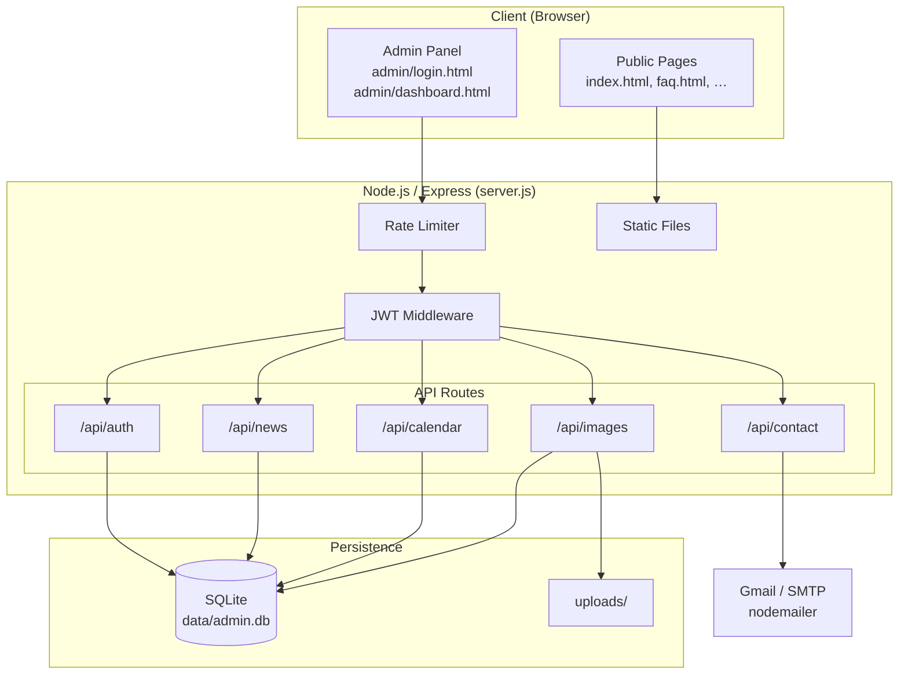
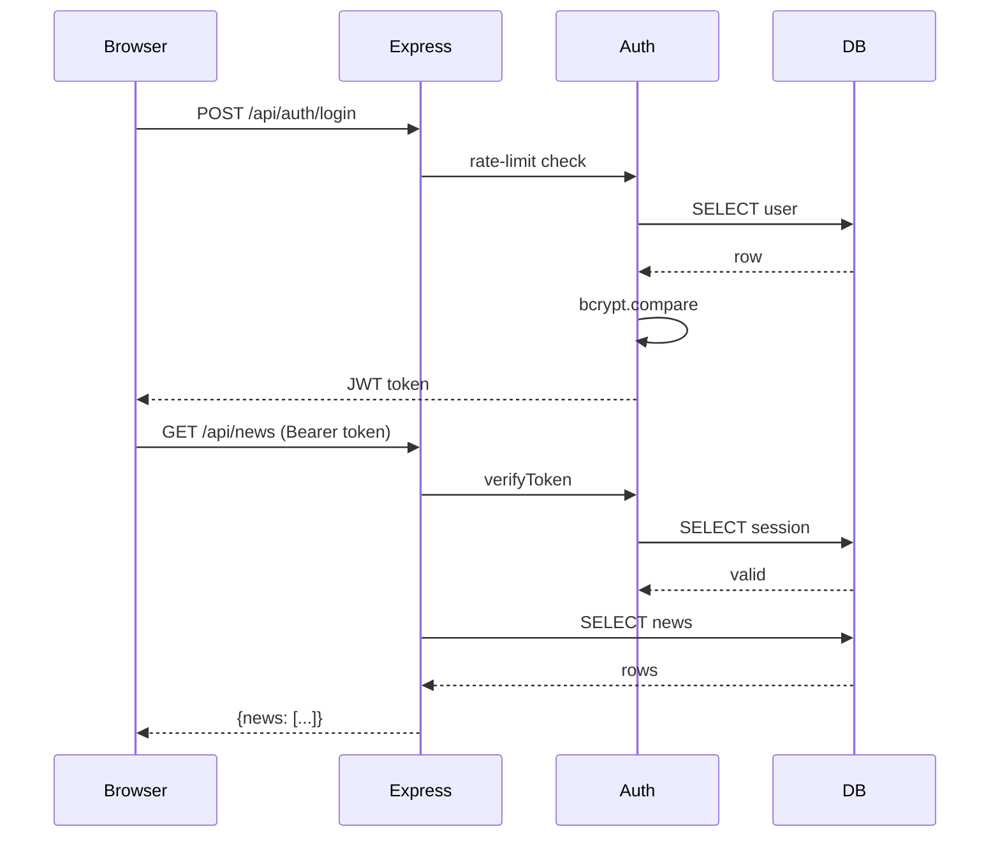

# Asnières Jujitsu — Site Web

Site web moderne pour le club de Jujitsu Traditionnel d'Asnières, développé en HTML/CSS/JavaScript avec un panneau d'administration sécurisé (Node.js + Express + SQLite).

---

## 🏗️ Architecture



---

## 🔄 Workflow



---

## 🚀 Fonctionnalités

### Site Public
- Page d'accueil avec présentation du club
- Actualités dynamiques
- Horaires, calendrier, tarifs
- Formulaire de contact
- Design responsive (mobile / tablette / desktop)

### Panneau d'Administration Sécurisé
- Authentification JWT + sessions SQLite
- Gestion des actualités (WYSIWYG Quill.js)
- Gestion du calendrier (WYSIWYG Quill.js)
- Upload d'images (multiple, miniatures automatiques, catégorisation)
- Rate limiting, bcrypt, protection CSRF

### Fonctionnalités Futures
- ⏳ Réservation de cours en ligne
- ⏳ Newsletter
- ⏳ Galerie photos publique
- ⏳ Notifications push
- ⏳ Blog avec commentaires

---

## 📁 Structure du Projet

```
ajj-clone/
├── index.html              # Page principale (entrée du site)
├── server.js               # Serveur Express
├── package.json
├── .env.example            # Template de configuration
│
├── Pages/                  # Pages publiques secondaires
│   ├── remise-en-forme.html
│   ├── comite-directeur.html
│   ├── quest-ce-que-le-ju-jitsu.html
│   ├── 5-bonnes-raisons.html
│   └── faq.html
│
├── admin/                  # Interface admin
│   ├── login.html / login.js
│   ├── dashboard.html / dashboard.js
│   └── admin-style.css
│
├── scripts/                # Scripts BASH et utilitaires
│   ├── START.sh            # Démarrage en mode détaché
│   ├── STOP.sh             # Arrêt gracieux
│   └── init-db.js          # Initialisation SQLite
│
├── routes/                 # Routes API
│   ├── auth.js
│   ├── news.js
│   ├── calendar.js
│   ├── contact.js
│   └── images.js
│
├── middleware/
│   ├── auth.js             # Middleware JWT
│   └── upload.js           # Multer
│
├── Docs/                   # Documentation
│   ├── Architecture.md
│   ├── Quickstart.md
│   └── ...
│
├── Dockerfile / docker-compose.yml
├── k8s/                    # Manifests Kubernetes
├── css/ / js/ / images/    # Assets publics
└── data/ / uploads/        # Données (gitignorées)
```

---

## ⚡ Démarrage Rapide

```bash
# 1. Installer les dépendances
npm install

# 2. Configurer l'environnement
cp .env.example .env
# Éditer .env — changer JWT_SECRET obligatoirement

# 3. Initialiser la base de données
npm run init-db

# 4. Démarrer (mode détaché)
./scripts/START.sh

# 5. Arrêter
./scripts/STOP.sh
```

👉 Voir [`Docs/Quickstart.md`](Docs/Quickstart.md) pour le guide complet.

---

## 🔧 Installation

| Prérequis | Version |
|-----------|---------|
| Node.js | v18 LTS ou v20 LTS |
| npm | inclus avec Node.js |

> ⚠️ Node.js v24+ n'est pas encore compatible avec `better-sqlite3`. Utilisez Node.js v20 LTS.

Voir [`Docs/SETUP.md`](Docs/SETUP.md) pour les détails complets.

---

## 🌐 Déploiement

### Docker (recommandé)

```bash
cp .env.example .env   # éditer les valeurs
docker-compose up -d
docker-compose exec app npm run init-db
```

### Kubernetes

```bash
kubectl apply -k k8s/
POD=$(kubectl get pods -n ajj-jujitsu -l app=ajj-app -o jsonpath='{.items[0].metadata.name}')
kubectl exec -n ajj-jujitsu $POD -- npm run init-db
```

Voir [`Docs/DOCKER-DEPLOYMENT.md`](Docs/DOCKER-DEPLOYMENT.md) pour le guide complet.

---

## 🔒 Sécurité

| Mécanisme | Détail |
|-----------|--------|
| Authentification | JWT (24h) + tracking de sessions |
| Mots de passe | bcrypt (10 rounds) |
| Rate limiting | 5 tentatives login / 15 min |
| SQL injection | Prepared statements |
| Variables sensibles | `.env` (jamais committé) |

**Avant la production :**
1. Générer un `JWT_SECRET` fort : `node -e "console.log(require('crypto').randomBytes(32).toString('hex'))"`
2. Changer les identifiants par défaut (`admin` / `admin123`)
3. Activer HTTPS (reverse proxy nginx / Apache)
4. `chmod 600 data/admin.db`

---

## 🛠️ Technologies

**Frontend** : HTML5, CSS3, JavaScript, Font Awesome, Quill.js  
**Backend** : Node.js, Express.js, better-sqlite3, bcrypt, jsonwebtoken, express-rate-limit, nodemailer, multer, sharp, uuid, dotenv

---

## 📄 Licence

Ce projet est distribué sous licence **ISC**.  
Fourni tel quel pour le club Asnières Jujitsu.

---

## 📚 Documentation

| Document | Description |
|----------|-------------|
| [`Docs/Quickstart.md`](Docs/Quickstart.md) | Démarrage rapide (scripts dans `scripts/`) |
| [`Docs/Architecture.md`](Docs/Architecture.md) | Diagrammes d'architecture |
| [`Docs/SETUP.md`](Docs/SETUP.md) | Installation détaillée |
| [`Docs/DOCKER-DEPLOYMENT.md`](Docs/DOCKER-DEPLOYMENT.md) | Docker & Kubernetes |
| [`Docs/EMAIL-SETUP.md`](Docs/EMAIL-SETUP.md) | Configuration email |
| [`Docs/IMAGE-UPLOAD-GUIDE.md`](Docs/IMAGE-UPLOAD-GUIDE.md) | Système d'upload |
| [`Docs/FEATURES-ROADMAP.md`](Docs/FEATURES-ROADMAP.md) | Feuille de route |
| [`Docs/README-SECURE-LOGIN.md`](Docs/README-SECURE-LOGIN.md) | Système d'authentification |

---

## 🐛 Dépannage

| Problème | Solution |
|----------|----------|
| Port déjà utilisé | `lsof -ti:3000` puis `kill <PID>` |
| Erreurs base de données | `rm data/admin.db && npm run init-db` |
| Login échoue | Vérifier `.env`, port correct, console navigateur |
| Erreur CORS | Vérifier `API_URL` dans les fichiers admin |

Logs du serveur : `tail -f server.log`

---

## 🔄 Historique des Versions

### v2.3 (Juillet 2026)
- ✅ Section Tarifs : ajout des colonnes Annuel Mineur (270€), Annuel Ceinture Noire (210€)
- ✅ Carrousel horizontal natif (scroll-snap) avec flèches et dots
- ✅ Copyright footer dynamique (année courante)
- ✅ Restructuration du projet selon les règles AGENTS.md (dossier `Docs/`, scripts dans `scripts/`)
- ✅ Diagrammes Mermaid dans `Docs/Architecture.md` et `README.md`

### v2.2 (Décembre 2025)
- ✅ Éditeur WYSIWYG (Quill.js) pour actualités et événements

### v2.1 (Décembre 2025)
- ✅ Upload multiple d'images, miniatures automatiques, catégorisation

### v2.0 (Décembre 2025)
- ✅ Backend Node.js/Express, SQLite, JWT, API RESTful complète

---

*Made with ❤️ by Bob*
