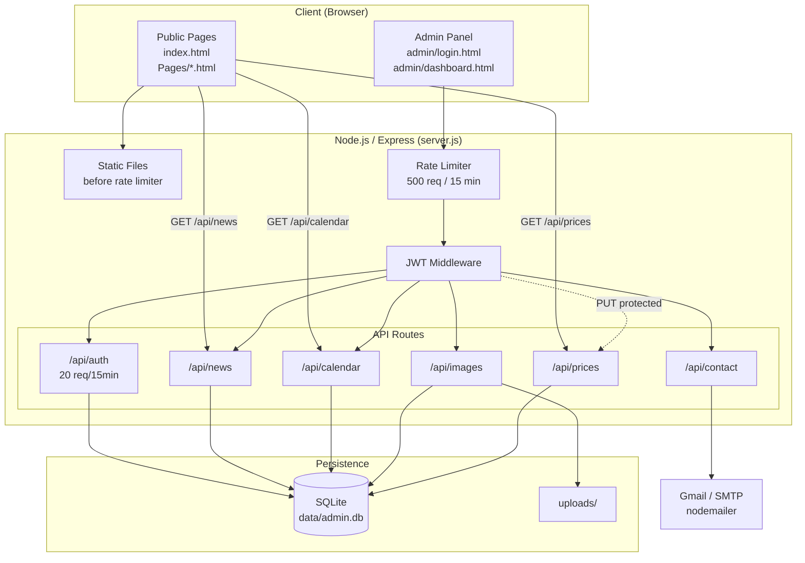
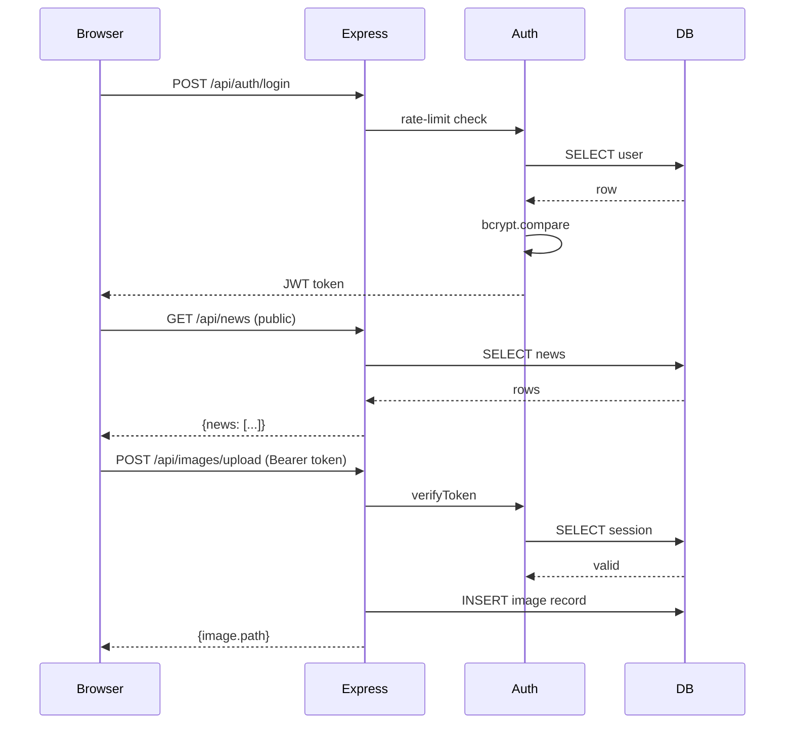

# Asnières Jujitsu — Site Web

Site web moderne pour le club de Jujitsu Traditionnel d'Asnières, développé en HTML/CSS/JavaScript avec un panneau d'administration sécurisé (Node.js + Express + SQLite).

---

## 🏗️ Architecture



---

## 🔄 Workflow



---

## 🚀 Fonctionnalités

### Site Public
- Page d'accueil avec présentation du club
- **Actualités** dynamiques avec images, carrousel horizontal natif (scroll-snap)
- **Calendrier des événements** avec images, carrousel horizontal natif
- **Tarifs** chargés dynamiquement depuis la base de données (avec fallback statique)
- Horaires, formulaire de contact
- Design responsive (mobile / tablette / desktop)

### Panneau d'Administration Sécurisé
- Authentification JWT + sessions SQLite
- **Onglet Actualités** — WYSIWYG Quill.js, image par URL **ou upload direct**
- **Onglet Calendrier** — WYSIWYG Quill.js, image par URL **ou upload direct**
- **Onglet Images** — Upload multiple, miniatures auto (Sharp), catégorisation, galerie
- **Onglet Tarifs** — Mise à jour des prix en temps réel
- Rate limiting ciblé (API uniquement, pas les fichiers statiques)
- bcrypt, prepared statements, protection SQL injection

### Fonctionnalités Futures
- ⏳ Réservation de cours en ligne
- ⏳ Newsletter
- ⏳ Galerie photos publique
- ⏳ Notifications push
- ⏳ Blog avec commentaires

---

## 📁 Structure du Projet

```
ajj-clone/
├── index.html              # Page principale (entrée du site)
├── server.js               # Serveur Express
├── package.json
├── .env.example            # Template de configuration
│
├── Pages/                  # Pages publiques secondaires
│   ├── remise-en-forme.html
│   ├── comite-directeur.html
│   ├── quest-ce-que-le-ju-jitsu.html
│   ├── 5-bonnes-raisons.html
│   └── faq.html
│
├── admin/                  # Interface admin
│   ├── login.html / login.js
│   ├── dashboard.html / dashboard.js
│   └── admin-style.css
│
├── scripts/                # Scripts BASH et utilitaires
│   ├── START.sh            # Démarrage en mode détaché
│   ├── STOP.sh             # Arrêt gracieux
│   └── init-db.js          # Initialisation SQLite
│
├── routes/                 # Routes API
│   ├── auth.js
│   ├── news.js
│   ├── calendar.js         # Inclut champ `image`
│   ├── contact.js
│   ├── images.js
│   └── prices.js
│
├── middleware/
│   ├── auth.js             # Middleware JWT + sessions
│   └── upload.js           # Multer (10 MB, UUID filenames)
│
├── Docs/                   # Documentation
│   ├── Architecture.md
│   ├── Quickstart.md
│   ├── SETUP.md
│   ├── DOCKER-DEPLOYMENT.md
│   ├── EMAIL-SETUP.md
│   ├── IMAGE-UPLOAD-GUIDE.md
│   ├── FEATURES-ROADMAP.md
│   └── README-SECURE-LOGIN.md
│
├── Dockerfile / docker-compose.yml
├── k8s/                    # Manifests Kubernetes
├── css/ / js/ / images/    # Assets publics
└── data/ / uploads/        # Données (gitignorées)
```

---

## ⚡ Démarrage Rapide

```bash
# 1. Installer les dépendances
npm install

# 2. Configurer l'environnement
cp .env.example .env
# Éditer .env — changer JWT_SECRET obligatoirement

# 3. Initialiser la base de données
npm run init-db

# 4. Démarrer (mode détaché)
./scripts/START.sh

# 5. Arrêter
./scripts/STOP.sh
```

👉 Voir [`Docs/Quickstart.md`](Docs/Quickstart.md) pour le guide complet.

---

## 🔧 Installation

| Prérequis | Version |
|-----------|---------|
| Node.js | v18 LTS ou v20 LTS |
| npm | inclus avec Node.js |

> ⚠️ Node.js v24+ n'est pas encore compatible avec `better-sqlite3`. Utilisez Node.js v20 LTS.

Voir [`Docs/SETUP.md`](Docs/SETUP.md) pour les détails complets.

---

## 🌐 Déploiement

### Docker / Podman (recommandé)

Image optimisée — **244 MB** (multi-stage Alpine, non-root).

```bash
cp .env.example .env          # éditer JWT_SECRET et EMAIL_*
mkdir -p data uploads logs

# Docker
docker-compose up -d
docker-compose exec app node scripts/init-db.js

# Podman
podman-compose up -d
podman exec ajj-app node scripts/init-db.js
```

Voir [`Docs/DOCKER-DEPLOYMENT.md`](Docs/DOCKER-DEPLOYMENT.md) pour le guide complet.

---

## 🔒 Sécurité

| Mécanisme | Détail |
|-----------|--------|
| Authentification | JWT (24h) + tracking de sessions SQLite |
| Mots de passe | bcrypt (10 rounds) |
| Rate limiting auth | 20 tentatives login / 15 min |
| Rate limiting API | 500 requêtes / 15 min (API uniquement) |
| Fichiers statiques | Hors rate limiter (pas de consommation de quota) |
| SQL injection | Prepared statements |
| Variables sensibles | `.env` (jamais committé) |

**Avant la production :**
1. Générer un `JWT_SECRET` fort : `node -e "console.log(require('crypto').randomBytes(32).toString('hex'))"`
2. Changer les identifiants par défaut (`admin` / `admin123`)
3. Activer HTTPS (reverse proxy nginx / Apache)
4. `chmod 600 data/admin.db`

---

## 🛠️ Technologies

**Frontend** : HTML5, CSS3, JavaScript (vanilla), Font Awesome, Quill.js  
**Backend** : Node.js, Express.js, better-sqlite3, bcrypt, jsonwebtoken, express-rate-limit, nodemailer, multer, sharp, uuid, dotenv

---

## 📄 Licence

Ce projet est distribué sous licence **ISC**.  
Fourni tel quel pour le club Asnières Jujitsu.

---

## 📚 Documentation

| Document | Description |
|----------|-------------|
| [`Docs/Quickstart.md`](Docs/Quickstart.md) | Démarrage rapide |
| [`Docs/Architecture.md`](Docs/Architecture.md) | Diagrammes d'architecture et schéma BDD |
| [`Docs/SETUP.md`](Docs/SETUP.md) | Installation détaillée |
| [`Docs/DOCKER-DEPLOYMENT.md`](Docs/DOCKER-DEPLOYMENT.md) | Docker & Kubernetes |
| [`Docs/EMAIL-SETUP.md`](Docs/EMAIL-SETUP.md) | Configuration email |
| [`Docs/IMAGE-UPLOAD-GUIDE.md`](Docs/IMAGE-UPLOAD-GUIDE.md) | Upload d'images (API + admin) |
| [`Docs/FEATURES-ROADMAP.md`](Docs/FEATURES-ROADMAP.md) | Feuille de route |
| [`Docs/README-SECURE-LOGIN.md`](Docs/README-SECURE-LOGIN.md) | Système d'authentification |

---

## 🐛 Dépannage

| Problème | Solution |
|----------|----------|
| Port déjà utilisé | `lsof -ti:3000` puis `kill <PID>` |
| Erreurs base de données | `rm data/admin.db && npm run init-db` |
| Login échoue | Vérifier `.env`, port correct, console navigateur |
| "Erreur de chargement" dans l'admin | Vérifier que le serveur tourne ; le rate limiter a peut-être été déclenché — redémarrer le serveur |
| Images non visibles dans la galerie admin | Vérifier que le serveur tourne et que `/api/images` répond avec un token valide |

Logs du serveur : `tail -f logs/server.log`

---

## 🔄 Historique des Versions

### v3.0 (Juillet 2026)
- ✅ **Images dans Actualités et Calendrier** — upload direct ou URL dans les formulaires admin
- ✅ **Champ `image` ajouté à `calendar_events`** en base de données
- ✅ **Widget image unifié** dans les onglets Actualités et Calendrier : URL + téléversement + aperçu + suppression
- ✅ **Carrousels horizontaux** (scroll-snap) pour Actualités et Calendrier sur la page publique
- ✅ **Bugfix : données API** — `loadNews()` et `loadCalendar()` lisaient `localStorage` au lieu de l'API
- ✅ **Bugfix : filtre date calendrier** — événements du jour exclus par erreur de comparaison UTC
- ✅ **Bugfix : galerie images admin** — crash `Too many parameter values` sur la requête count
- ✅ **Bugfix : structure HTML dashboard** — onglet Images imbriqué dans `<tbody>` du calendrier
- ✅ **Bugfix : `API_URL` hardcodé** — remplacé `http://localhost:3000/api` par `/api` relatif
- ✅ **Rate limiter corrigé** — fichiers statiques hors quota ; limite API portée à 500/15min

### v2.5 (Juillet 2026)
- ✅ **Tarifs dynamiques** — table `prices` en SQLite, chargement API dans `index.html`
- ✅ **Onglet "Tarifs" dans l'admin** — mise à jour des prix depuis le tableau de bord
- ✅ Nouveau endpoint `GET /api/prices` (public) et `PUT /api/prices/:id` (protégé)

### v2.4 (Juillet 2026)
- ✅ Image Docker/Podman optimisée — multi-stage Alpine, **244 MB**, non-root

### v2.3 (Juillet 2026)
- ✅ Section Tarifs : carrousel horizontal natif (scroll-snap)
- ✅ Restructuration du projet (`Docs/`, `scripts/`, `Pages/`)

### v2.2 (Décembre 2025)
- ✅ Éditeur WYSIWYG (Quill.js) pour actualités et événements

### v2.1 (Décembre 2025)
- ✅ Upload multiple d'images, miniatures automatiques, catégorisation

### v2.0 (Décembre 2025)
- ✅ Backend Node.js/Express, SQLite, JWT, API RESTful complète

---

*Made with ❤️ by Bob*
